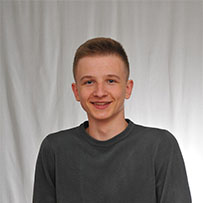

## ABOUT ME

Like all guys, I started learning programming at school on the subject of computer science. And my very first programming language was Pascal. Also at school I got acquainted with html and css. Since then I am interested in programming. In the future, I experimented with many areas of programming. I began to take more conscious steps in the second year of university, when I decided on the direction of development. My choice fell on the web.
The last few months I have been studying it. 
I delve into learning C # programming language and also doing various exercises.

In addition to programming I learn English. From a young age, I set out to speak fluently in a foreign language and still do it.

## EDUCATION

Belarusian National Technical University, Sep 2017 – Present Faculty of Information Technology and Robotics, Information Technology Software

## INTERESTS

Most of my free time I try to give reading. In particular, I like the direction of biographies of people, which tells about views on life, beliefs and values.
Of course, I do sports. Without this, I can not imagine free life. Sport helps me to rest my head and put my body in order.

## WORK EXAMPLES

[Simple calculator](https://github.com/kdanilyuk/FancyCalc)  
[Task 1](https://github.com/kdanilyuk/PadawansTask1)  
[Task 2](https://github.com/kdanilyuk/PadawansTask2)  
[Task 3](https://github.com/kdanilyuk/PadawansTask3)  
[Task 4](https://github.com/kdanilyuk/PadawansTask4)  
[Task 5](https://github.com/kdanilyuk/PadawansTask5)  
[Task 7](https://github.com/kdanilyuk/PadawansTask7)   
[Task 8](https://github.com/kdanilyuk/PadawansTask8)   
[Task 9](https://github.com/kdanilyuk/PadawansTask9)   
[Task 10](https://github.com/kdanilyuk/PadawansTask10)   
[Task 11](https://github.com/kdanilyuk/PadawansTask11)    
[Task 12](https://github.com/kdanilyuk/PadawansTask12)   

